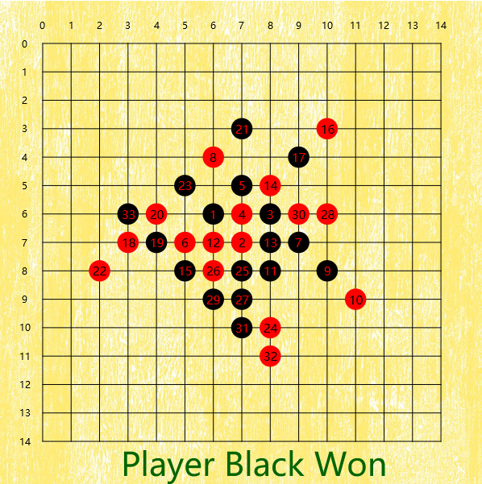

# Gomoku

[**Gomoku**](https://en.wikipedia.org/wiki/Gomoku), also called Gobang or Five in a Row, is a board game plays a little bit more like Tic-Tac-Toe but requires a row of five stones for a win.

This game was developed with Java and contains three main components:

- A smart [AI](src/game/AI.java) player built by using minimax search algorithm with Alpha-beta pruning and optimization with heuristic approach to finding next better moves for game tree exploration.
- A clear and concise [Gomoko](src/game/Gomoku.java) game class implements all the game rules and data storage.
- A clean [GUI](src/game/GomokuGUI.java) built with JavaFX.

